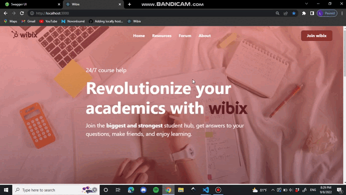

# Wibix

A student hub web application made with ReactJS and ASP.NET Core 6 webapi.

---

### Features

- Resource sharing
  - Uploading pdf files to the backend
  - Displaying files from the backend
  - Downloading
  - Searching for resources by school/course/keywords
  - Upvoting/Downvoting resources
- Forum
  - Posting questions and starting threads
  - Answering questions
  - Upvoting/downvoting posts and answers
- Authentication
  - Signup and Login
  - Uses Jwt tokens
- Styling mostly done with bootstrap

<br/>

### Future improvements
- OAuth2

<br/>

### Build and run instructions

``npm install`` to install all the dependencies

``npm start`` to start the development server in http://localhost:3000

``npm run build`` to build the application for production

<br/>

### Note

When connecting to the backend make sure to use the correct URL in ```.env.development```

<br/>




